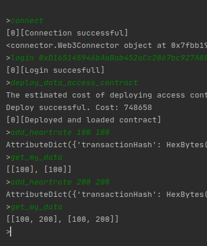
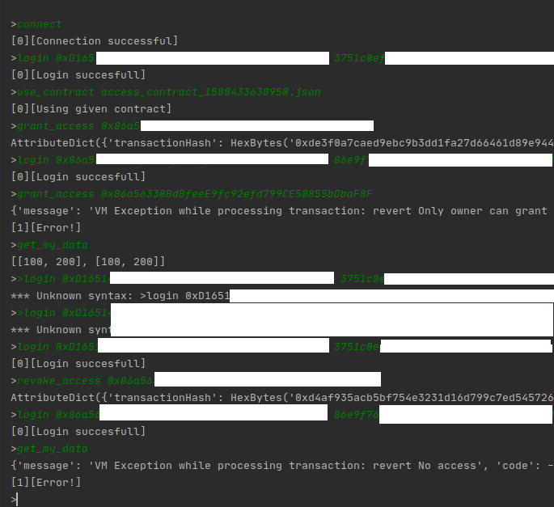

# python-blockchain-eth
> Short university task using blockchain platform & smart contracts on Ethereum network.

## Requirements:
* Deploy a local ethereum network on localhost, port 7545 (i.e. with Ganache)
* Deploy a local mosquitto server on localhost, port 1883
* Install the requirements `python3 -m pip install -r requirements.txt`

## Usage:
'''
After running Ganache:

health_care_shell - command line interface (can be connected with IoT device)
health_care_shell test flow:
* run
* type following commands:
* `connect`
>(connects to blockchain)
* `login (account address from ganache) (account pk from ganache)`
* `login_file (path to JSON file with credentials: address and key)` // alternative
>(like login 0x344.... 12rf21ccac22e...)
* `deploy_data_access_contract`
>(creates and deploys smart contract for given account  
  after deployment, it saves json file in cache dir  
you can then connect to existing contract by typing:  
use_contract (file name) )
* `add_heartrate (heartrate) (timestamp)`
>(adds new heartrate measurement entry)
* `get_my_data`
>(shows all data from selected previously contract)

You can also in health_care_shell use commands:
- `grant_access (account address)` - that grants access to reading data for given account (only contracts owner can execute this)
- `revoke_access  (account address)` - that revokes access to reading data for given account (only contracts owner can execute this)

Some flow examples:





'''

##### How to run smart band script
`python3 smart_band.py [host] [port]`
Host and port default to `127.0.0.1:1883`.

#### Tools:
* Python (version >= 3.6.9)
* Web3.py
* Ganache - Local Ethereum Network
* [Remix IDE](https://remix.ethereum.org/) - IDE for writing Smart Contracts
* Solidity
* [Truffle.js](https://www.trufflesuite.com/)
* mosquitto MQTT server
* paho-mqtt library

#### How to run mosquitto
```
mosquitto -c mosquitto.conf
```

#### How to run Ganache
```
ganache-cli -p 7545

Or run Appimage downloaded from ganache and run quickstart
```

##### How to compile Smart Contracts
```
truffle compile [--network development]
```

##### How to deploy Smart Contracts on Ganache
```
truffle deploy [--network development]
```

#### Misc
```
truffle help <command>
```

##### Contributors

* [Rafał Juraszek](http://github.com/RafalJuraszek)
* [Olgierd Królik](http://github.com/olliekrk)
* [Wiktor Pawłowski](http://github.com/wiktor145)
